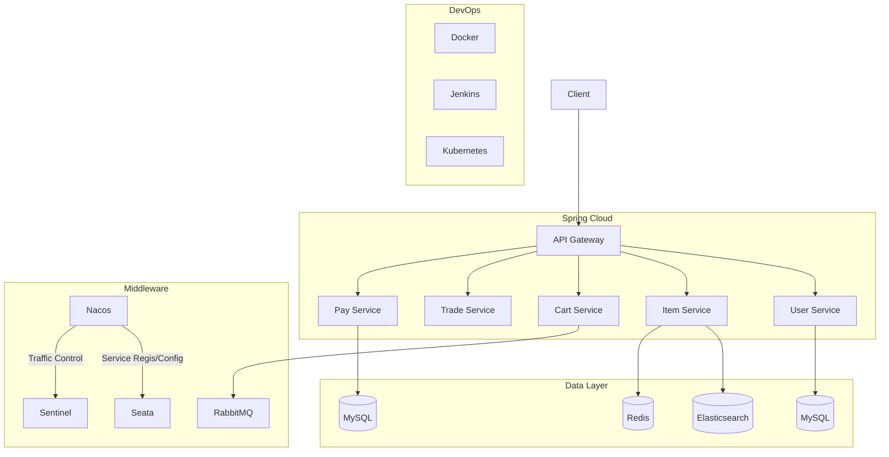

# easyBuy - practice project for E-commerce platform

A simplified e-commerce platform built with microservices architecture, handling product management, order processing, payment integration, and inventory control.

## Features

### Core Modules
- **User Service**  
  JWT authentication, RBAC authorization, OAuth2 social login integration
- **Product Service**  
  Elasticsearch-powered search, multi-level categorization, inventory tracking
- **Order Service**  
  Distributed transaction management, order state machine, timeout cancellation
- **Payment Service**  
  Alipay sandbox integration, payment status reconciliation
- **Cart Service**  
  Redis-based shopping cart with expiration policy
- **Inventory Service**  
  Optimistic locking for stock deduction, oversell prevention

### Key Technical Implementations
- Distributed transaction coordination using Seata AT mode
- Redis+Lua script implementation for spike sales
- Elasticsearch aggregation for product analytics
- Spring Cloud Gateway rate limiting & circuit breaking
- Prometheus+Grafana monitoring with custom metrics
- Kubernetes horizontal pod autoscaling

## Tech Stack

| Category        | Technologies                                                                 |
|-----------------|------------------------------------------------------------------------------|
| **Backend**     | Java 11, Spring Boot 2.7.12, Spring Cloud 2021.0.3, Spring Cloud Alibaba 2021.0.4.0  |
| **Database**    | MySQL 8.0.23, Redis, Elasticsearch                                           |
| **Middleware**  | RabbitMQ (Spring AMQP), Seata 1.8.6, Nacos 2.2, Sentinel 1.8.6               |
| **DevOps**      | Docker, Kubernetes, Jenkins                                                  |
| **Monitoring**  | MyBatis-Plus 3.4.3, Lombok 1.18.20, Hutool 5.8.11, Spring Cloud Gateway      |

## Architecture

See project document: [Feishu](https://b11et3un53m.feishu.cn/wiki/FYNkwb1i6i0qwCk7lF2caEq5nRe)
